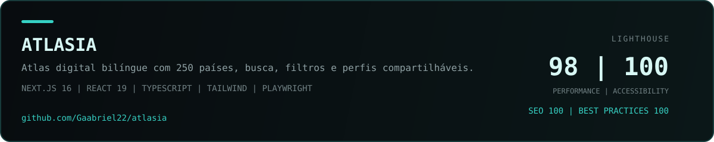
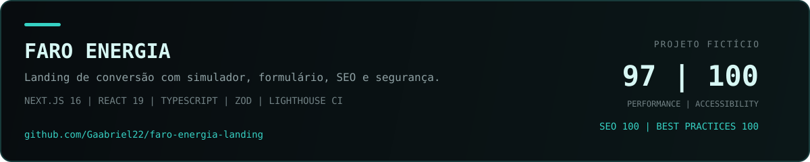
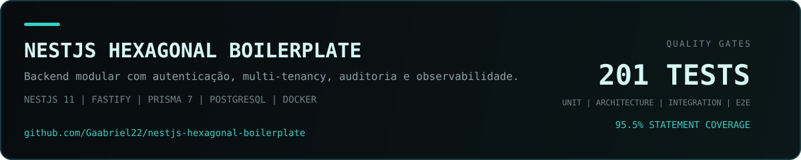
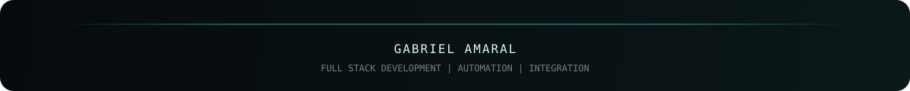

<div align="center">
  
</div>

<div align="center">
  <a href="https://git.io/typing-svg">
    
  </a>
</div>

<div align="center">
  <a href="https://gabrielamaral.vercel.app/">
    
  </a>
  <a href="https://www.linkedin.com/in/gabrielamaral22/">
    
  </a>
  <a href="mailto:gabrielvieira2205@gmail.com">
    
  </a>
</div>

<br />

## Sobre mim

Sou **Gabriel Amaral**, Desenvolvedor Full Stack em São Paulo. Transformo operações complexas em software simples de usar, do entendimento do problema ao deploy.

Atuo com interfaces, APIs, bancos de dados, integrações e automações. Minha experiência inclui plataformas para eventos, sistemas white-label, operação offline, controle de acesso e produtos com inteligência artificial aplicada a problemas reais.

- Desenvolvedor Full Stack na **INAC Sistemas**
- Formação em **Análise e Desenvolvimento de Sistemas pela UNIP**
- Foco em arquitetura, qualidade de código, acessibilidade, segurança e desempenho

> Tecnologia boa desaparece no uso e deixa o trabalho melhor do que encontrou.

## Tech stack

<div align="center">
  <p><strong>Stack principal</strong></p>
  
</div>

<br />

<div align="center">
  <p><strong>Ecossistema e outras experiências</strong></p>
  
</div>

## Ferramentas

<div align="center">
  
  <br /><br />
  
  
  
  
  
</div>

## Projetos em destaque

<a href="https://github.com/Gaabriel22/atlasia">
  
</a>

<div align="right"><a href="https://atlasia-world.vercel.app/">Abrir aplicação</a></div>

<a href="https://github.com/Gaabriel22/faro-energia-landing">
  
</a>

<div align="right"><a href="https://faro-energia.vercel.app/">Abrir aplicação</a></div>

<a href="https://github.com/Gaabriel22/nestjs-hexagonal-boilerplate">
  
</a>

## Objetivos atuais

```console
gabriel@dev:~$ cat current-focus.txt

[01] Construir produtos web robustos e úteis
[02] Aprofundar arquitetura backend com NestJS e Go
[03] Aplicar IA e automação a problemas reais
[04] Publicar projetos com testes, acessibilidade e performance

gabriel@dev:~$ _
```

## GitHub analytics

<div align="center">
  
  
</div>

<br />

<div align="center">
  
</div>

<br />

<div align="center">
  
</div>

## GitHub trophies

<div align="center">
  
</div>

## Contribution snake

<div align="center">
  <picture>
    <source media="(prefers-color-scheme: dark)" srcset="https://raw.githubusercontent.com/Gaabriel22/Gaabriel22/output/github-contribution-grid-snake-dark.svg" />
    <source media="(prefers-color-scheme: light)" srcset="https://raw.githubusercontent.com/Gaabriel22/Gaabriel22/output/github-contribution-grid-snake.svg" />
    
  </picture>
</div>

## Contato

<div align="center">
  <p>Tem um produto web para construir ou um processo manual pedindo automação?</p>
  <a href="https://gabrielamaral.vercel.app/">
    
  </a>
  <a href="https://www.linkedin.com/in/gabrielamaral22/">
    
  </a>
</div>

<br />

<div align="center">
  
</div>
